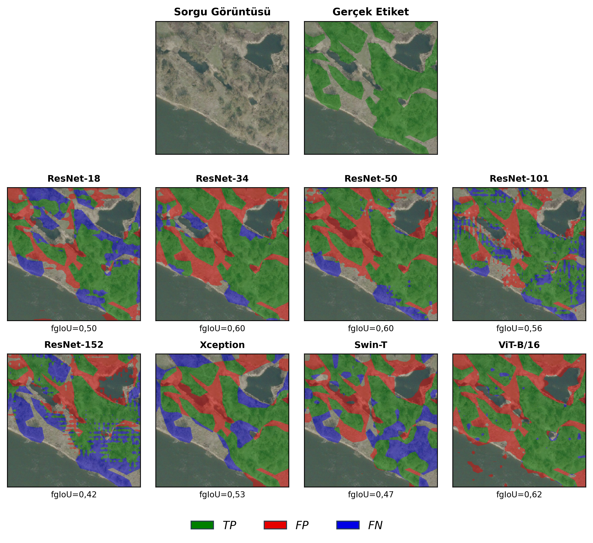
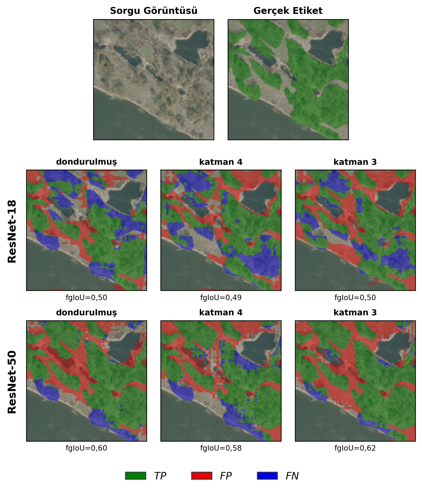
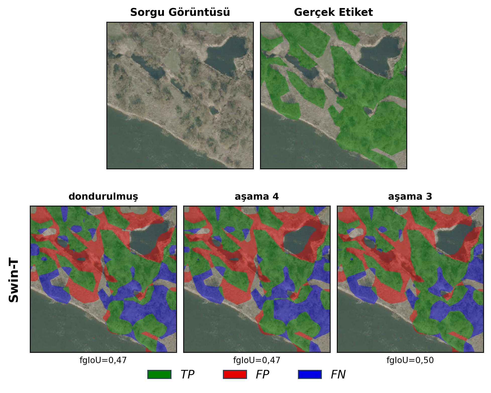
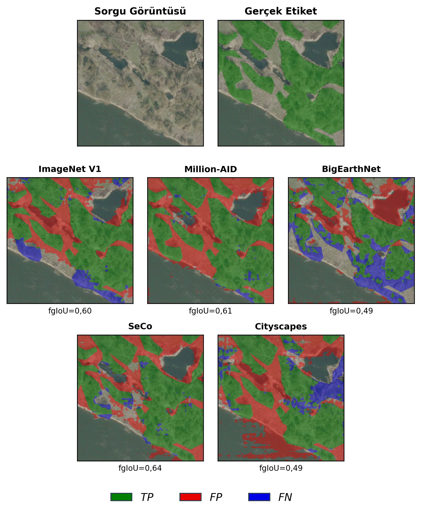

# Few-Shot Woodland Segmentation

> Master's thesis: **Woodland Segmentation in High-Resolution Aerial Imagery Using Few-Shot Learning**

Implements a ProtoNet (prototypical network) based **1-way 5-shot binary segmentation** pipeline on [LandCover.ai v1](https://landcover.ai/), with `building`, `water`, and `road` as base (training) classes and `woodland` as the novel (test) class.

## Qualitative Results

Predictions on a representative medium-difficulty query tile from the held-out woodland class. Per-tile fgIoU is shown below each panel. Overlay colors: 🟢 True Positive · 🔴 False Positive · 🔵 False Negative.

**Experiment 1 — Backbone comparison** (ResNet-{18, 34, 50, 101, 152}, Xception, Swin-T, ViT-B/16, all frozen):

<p align="center">
  
</p>

**Experiment 2 — Layer unfreezing (ResNet)** (ResNet-18 and ResNet-50 × `{frozen, layer4, layer3}`):

<p align="center">
  
</p>

**Experiment 3 — Stage unfreezing (Swin-T)** (Swin-T × `{frozen, stage4, stage3}`):

<p align="center">
  
</p>

**Experiment 4 — Pretrained weight comparison** (ResNet-50 × `{ImageNet V1, Million-AID, BigEarthNet, SeCo, Cityscapes}`, frozen):

<p align="center">
  
</p>

Easy and hard-difficulty variants are available in [figures/qualitative_results/](figures/qualitative_results/) as `exp*_kolay.png` and `exp*_zor.png`.

## Project Structure

```
few-shot-woodland-segmentation/
├── src/
│   ├── config.py                       # Pydantic config — all hyperparameters and paths
│   ├── dataset.py                      # Episodic dataset, 5-fold CV, cross-directory tile loading
│   ├── model.py                        # ProtoNet + dilated ResNet / Swin / ViT / Xception backbones
│   ├── utils.py                        # FocalLoss, Dice loss, segmentation metrics
│   └── preprocess.py                   # Tiling, image-level split, k-fold splits, tile registry
├── train.py                            # Episode-based training, MLflow logging, AMP
├── eval.py                             # 5-fold test evaluation, MLflow logging
├── data/
│   ├── raw/landcover.ai.v1/            # LandCover.ai v1 (images/, masks/) — not tracked
│   └── processed/                      # Generated by src/preprocess.py — not tracked
│       ├── image_level_split.json
│       ├── tile_registry.json
│       └── tiles/{train,val,test}/{images,masks}/
├── experiments/
│   ├── checkpoints/                    # Best checkpoints per (backbone, pretrained, unfreeze, fold)
│   └── pretrained_weights/             # External pretrained backbones (Cityscapes, BigEarthNet, ...)
├── notebooks/
│   ├── 01_EDA.ipynb                    # Exploratory data analysis on raw dataset
│   ├── 02_verify_pipeline.ipynb        # Sanity checks for tiling, splits, episodic sampling
│   ├── 03_training_dynamics.ipynb      # Training/validation curve analysis from MLflow runs
│   ├── 04_quantitative_results.ipynb   # Cross-fold metric aggregation and result tables
│   ├── 05_qualitative_results.ipynb    # Per-experiment prediction overlays (TP/FP/FN)
│   └── visualize.ipynb                 # Standalone visualization utilities
├── figures/{EDA,verify_pipeline,training_dynamics,quantitative_results,qualitative_results}/
├── scripts/
│   ├── build_image.slurm               # Build Apptainer image on HPC
│   ├── run_altay.slurm                 # HPC SLURM job: train + eval
│   ├── run_benchmark.slurm             # HPC SLURM job: benchmark sweep
│   └── run_eval.slurm                  # HPC SLURM job: eval only
├── Dockerfile                          # PyTorch 2.1.0 + CUDA 11.8 base
├── pyproject.toml                      # Poetry / PEP 621 dependencies
├── LICENSE                             # MIT
└── README.md
```

Trained checkpoints are **not** included in this repository. They are published on Hugging Face: [zmgul/few-shot-woodland-segmentation](https://huggingface.co/zmgul/few-shot-woodland-segmentation).

## Installation

Two equivalent installation paths are supported. Docker is recommended for HPC reproducibility (the image converts cleanly to Apptainer); Poetry is recommended for local development.

### Docker

```bash
docker build -t woodland .
docker run --gpus all --rm -it -v "$PWD:/app" woodland bash
```

The image is based on `pytorch/pytorch:2.1.0-cuda11.8-cudnn8-runtime` and installs Python dependencies via Poetry at build time.

### Poetry

```bash
poetry install
poetry shell
```

Requires Python `>=3.10,<3.15` and a CUDA 11.8 capable PyTorch wheel for GPU training.

## Data Preparation

LandCover.ai v1 must be downloaded separately and placed under [data/raw/landcover.ai.v1/](data/raw/landcover.ai.v1/) with `images/` and `masks/` subdirectories of `.tif` files. The preprocessing step produces 512×512 tiles, a stratified image-level train/val/test split (70/15/15, stratified on resolution group), 5-fold stratified splits, and a per-tile class-pixel registry.

```bash
# Primary split + tiling + registry
python -m src.preprocess

# Same as above plus the 5-fold splits used by train.py / eval.py
python -m src.preprocess --kfold
```

Outputs:
- [data/processed/image_level_split.json](data/processed/image_level_split.json) — image metadata, primary split, tile lists, k-fold assignments
- [data/processed/tile_registry.json](data/processed/tile_registry.json) — per-tile, per-class pixel statistics (no filtering applied)
- `data/processed/tiles/{train,val,test}/{images,masks}/` — PNG tiles

## Training

```bash
python train.py
```

`train.py` reads every parameter from [src/config.py](src/config.py) and runs all 5 cross-validation folds in sequence. Each fold produces one MLflow run named `ProtoNet_<backbone>_<pretrained>_<unfreeze>_fold<i>_seed-42` and saves the best-validation-mIoU checkpoint to [experiments/checkpoints/](experiments/checkpoints/).

Key defaults (see [src/config.py](src/config.py)):

| Parameter | Value |
|-----------|-------|
| `RANDOM_SEED` | `42` |
| `K_SUPPORT` | `5` (5-shot) |
| `INPUT_SIZE` | `473` (PFENet/HSNet convention) |
| `TOTAL_EPISODES` | `50000` |
| `VAL_INTERVAL` | `1000` episodes |
| `BATCH_SIZE` | `4` episodes |
| `LR` / `BACKBONE_LR_FACTOR` | `1e-4` / `0.1` |
| Loss | Focal (α=0.25, γ=2.0) + 0.5 × Dice |
| Mixed precision | Enabled for ResNet backbones |

To change the experiment, edit `BACKBONE`, `PRETRAINED`, and `UNFREEZE_FROM` in `src/config.py` and re-run `python train.py`. Cosine-annealing LR schedule and gradient clipping (norm 5.0) are applied.

Inspect runs with:

```bash
mlflow ui --backend-store-uri ./mlruns
```

## Evaluation

```bash
python eval.py
```

`eval.py` walks the same 5 folds, locates the matching checkpoint under [experiments/checkpoints/](experiments/checkpoints/) (naming derived from the current config), evaluates on the held-out test split for `TEST_EPISODES=2000` episodes per fold, and logs per-fold metrics plus a `SUMMARY_*` run with mean ± std across folds.

Reported metrics: `fgIoU`, `mIoU`, `precision`, `recall`, `f1`.

## Experiments and Results

Four experiments were run, each as a 5-fold CV sweep with `seed=42`. Results are reported as mean ± std of `fgIoU` on the held-out test fold (woodland as novel class).

| # | Experiment | Sweep |
|---|------------|-------|
| 1 | Backbone comparison | ResNet-{18, 34, 50, 101, 152}, Xception, Swin-T, ViT-B/16 — backbone frozen |
| 2 | Layer unfreezing (ResNet) | ResNet-{18, 50} × `unfreeze ∈ {none, layer4, layer3}` |
| 3 | Stage unfreezing (Swin-T) | Swin-T × `unfreeze ∈ {none, stage4, stage3}` |
| 4 | Pretrained weight comparison | ResNet-50 × `pretrained ∈ {ImageNet-V1, Cityscapes, MillionAID, BigEarthNet, SeCo}` |

The best configuration — SeCo-pretrained ResNet-50 (frozen) — achieves **fgIoU = 0.556 ± 0.071** on the held-out woodland class, outperforming all supervised pretraining sources by **Δ ≥ 0.054**.

Per-fold numbers, full metric tables, and training curves are published with the checkpoints on the Hugging Face model card: [zmgul/few-shot-woodland-segmentation](https://huggingface.co/zmgul/few-shot-woodland-segmentation).

## Notebooks

- [01_EDA.ipynb](notebooks/01_EDA.ipynb) — class-ratio and resolution-group exploratory analysis over the raw dataset
- [02_verify_pipeline.ipynb](notebooks/02_verify_pipeline.ipynb) — sanity checks for tiling, splits, and episodic sampling
- [03_training_dynamics.ipynb](notebooks/03_training_dynamics.ipynb) — training/validation curve analysis from MLflow runs
- [04_quantitative_results.ipynb](notebooks/04_quantitative_results.ipynb) — cross-fold metric aggregation and result tables
- [05_qualitative_results.ipynb](notebooks/05_qualitative_results.ipynb) — per-experiment prediction overlays (TP/FP/FN)
- [visualize.ipynb](notebooks/visualize.ipynb) — standalone visualization utilities used by the figures

## Tech Stack

| Component | Tool |
|-----------|------|
| Framework | PyTorch 2.1.0 (CUDA 11.8) |
| Vision models | torchvision 0.16.0, timm |
| Experiment tracking | MLflow |
| Config | Pydantic v2 |
| Containerization | Docker → Apptainer |
| Scheduler | SLURM |
| Compute | NVIDIA A100 80GB |

## Citation

If you use this work, please cite the underlying thesis:

```bibtex
@mastersthesis{gul2026woodland,
  author  = {Gül, Zehra Merve},
  title   = {Woodland Segmentation in High-Resolution Aerial Imagery Using Few-Shot Learning},
  school  = {İstanbul University, Institute of Graduate Studies in Sciences},
  year    = {2026},
  type    = {Master's thesis}
}
```

## License

Released under the [MIT License](LICENSE).
